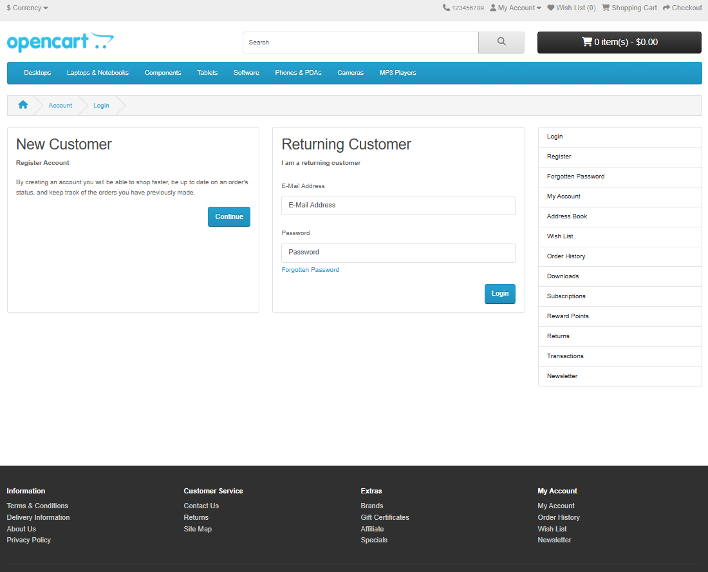

### OPEN CART (MANUAL TESTING)

## Introduction
As a tester, you can view the OpenCart demo as a complete, miniature e-commerce application ready for you to explore and evaluate. It's a risk-free and accessible environment to practice and demonstrate your testing skills. 
In the perspectives of user "OpenCart is a free and open-source e-commerce platform for creating and managing free online stores. It is user-friendly, customizable, and can support many products, payment methods, and extensions. Businesses typically use the platform to sell products online, manage a list of customers, and manage orders all from one place." which is going to be tested by Testers.

## Interfaces where Test is performed
#### 1. Front Page

#### 5.Login Page

#### 6.register Page

#### 7.shopping Page

#### 8. Search result

## Conclusion
Overall, the manual testing of the OpenCart demo revealed that the application is largely stable and functional, especially concerning its core e-commerce features. The testing covered key user journeys, including account creation, product browsing, and the checkout process, with a high percentage of test cases passing as expected. 

