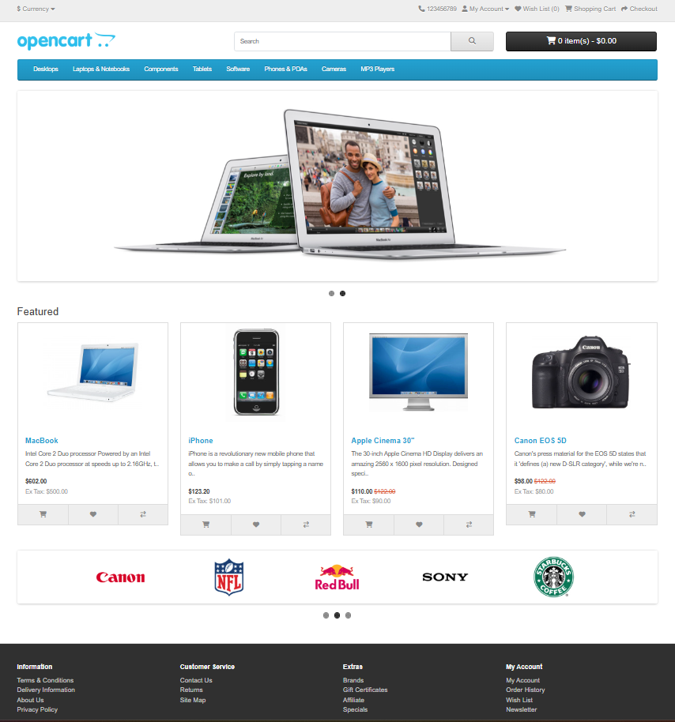
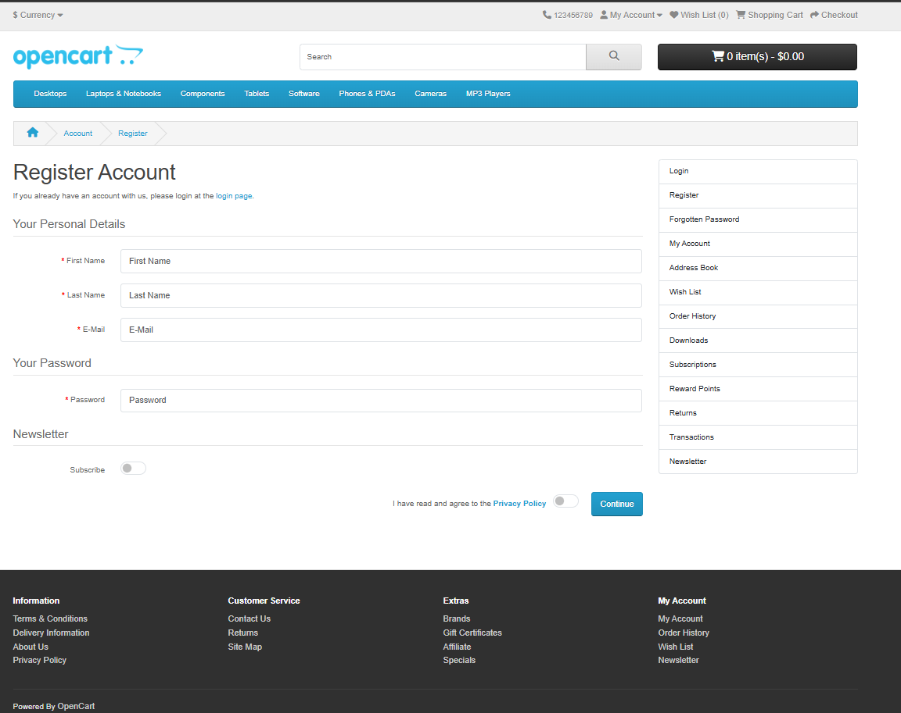
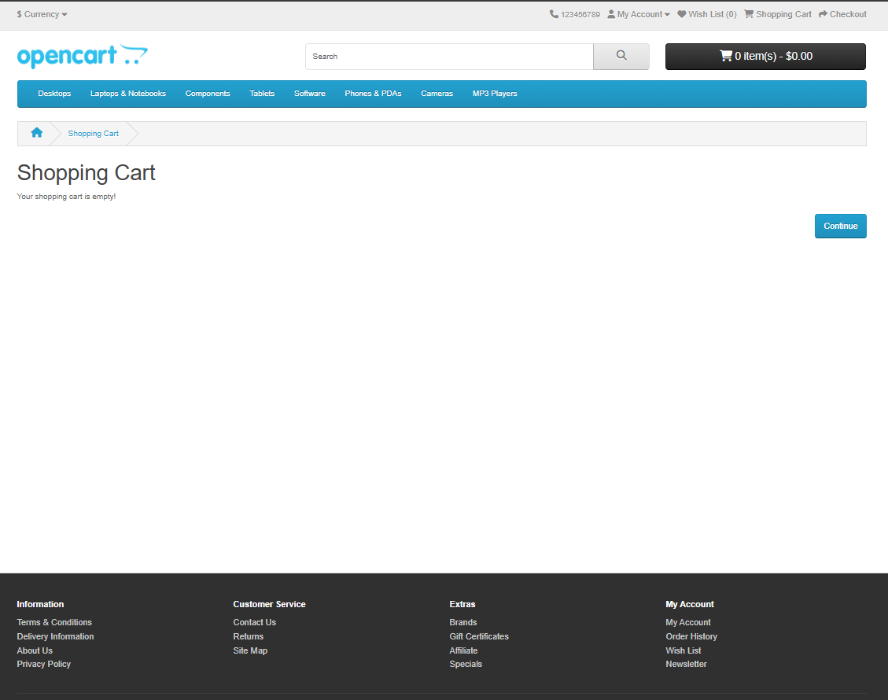
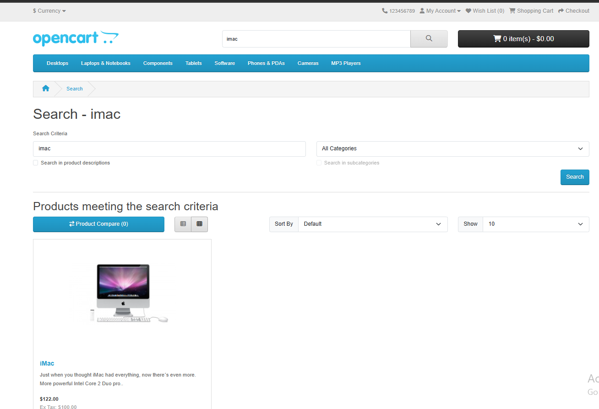

### OPEN CART (MANUAL TESTING)

## Introduction

OpenCart is a free and open-source e-commerce platform for creating and managing free online stores. It is user-friendly, customizable, and can support many products, payment methods, and extensions. Businesses typically use the platform to sell products online, manage a list of customers, and manage orders all from one place.

## Interfaces where Test is performed
#### 1. Front Page

#### 5.Login Page
.png)

#### 6.register Page

#### 7.shopping Page

#### 8. Search result

#### 9.Balancecheck Page

